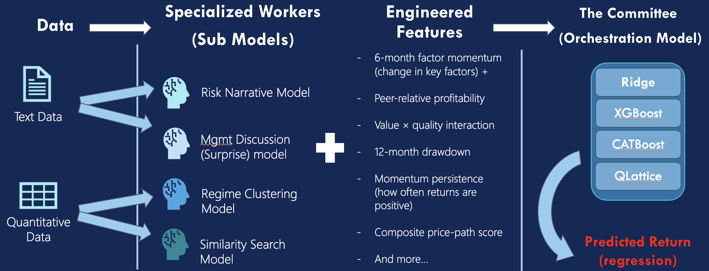
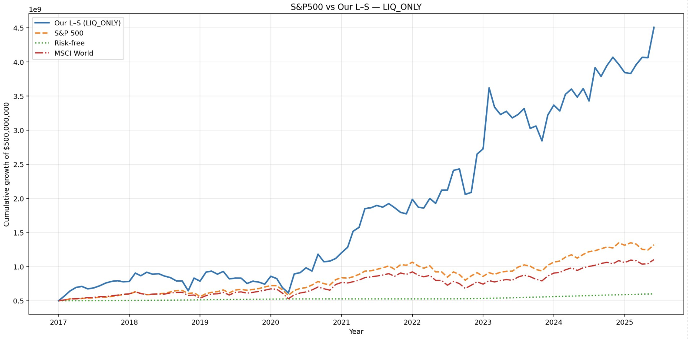

# FIAM 2025 — Reverse Algo Submission
This is the project that was submitted for the FIAM 2025 Hackathaon for our team Reverse Algo.
This project got us **4th** place at FIAM. 
[FIAM 2025 Official Site](https://hackathonfinance.com/)

## Overview
Reverse Algo developed an ensemble trading architecture tailored for **small-cap equities**, integrating complementary signals that capture distinct dimensions of market behavior.

The system combines four independent sub-models:

- **Text-Based Sentiment & Risk-Tone Models** — extract linguistic cues around risk, optimism, and earnings-surprise context.
- **Regime-Clustering Module** — identifies shifts in volatility, liquidity, and momentum environments.
- **Factor-Momentum Pipeline** — captures style rotation across value, quality, reversal, and momentum factors.
- **Historical Similarity Engine** — uses vector similarity search to match current market states to historical precedents.

Outputs from these modules feed into a **four-learner meta-model**, with each learner transforming the feature set differently.  
The meta-model dynamically reweights its internal components based on validation performance, enabling real-time adaptation to evolving market regimes.

---

## Trading Strategy
The portfolio operated as a **70% long / 30% short** book with **150/50 leverage**, allocating exposures based on:

- signal strength  
- conviction thresholds  
- dynamic risk scoring  
- portfolio constraints  
- number of qualifying securities  

Trades are picked at the beginning of each month, based on the data on the previous months. 
This ensured **capital-efficient scaling** while avoiding overexposure or overfitting to transient signals.

---

## Performance Summary
During the full test period, the strategy delivered:

- **Annualized Return:** 34%  
- **Sharpe Ratio:** 0.93  
- **CAPM Alpha:** 16%  
- **Beta:** 1.26  
- **Information Ratio:** 0.56  
- **Directional Accuracy (meta-model):** 51.1%  
- **Max Drawdown:** –0.42  
- **Monthly Turnover:** 0.78  
- **Small-Cap Exposure:** 98%  
- **Annualized Fee Drag:** 18%

Performance was especially strong post-2020, when persistent momentum regimes favored the ensemble’s dynamic weighting and adaptive allocation processes.

---

# Model Architecture

## System Diagram
Text and quantitative data flow into four specialized sub-models:
Risk Narrative, Management Discussion (Surprise), Regime Clustering, and Similarity Search.
Their outputs combine with engineered features like factor momentum, profitability, value–quality interactions, and price-path metrics.

All signals are then fed into The Committee, an ensemble of Ridge, XGBoost, CATBoost, and QLattice, which produces the final predicted return used for trading.

## Equity Curve
Equity Curve from 2017 to 2025 compared to the S&P500 and MSCI World Index. 

## Authors
- Samuel Beadoin
- Theodor Semerdzhiev
- Carter Cameron
- Luyun Chen
- Nicholas Charland Armstrong 
